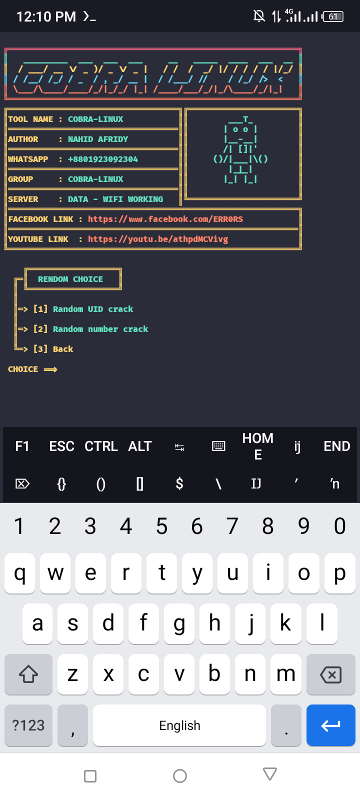

# Rendom-BD
Free in rendom clone our all paid 💯

## Install Symbol 👇

    pkg install python
    pkg install git
    pkg install python2
    pkg install toilet
    pip install bs4
    pip install rich
    git clone https://github.com/NAHID-AFRIDY/Rendom-BD
    cd Rendom-BD
    python run.py

## All Time Run 👇

    cd Rendom-BD
    python run.py

## Screenshot 🔥

